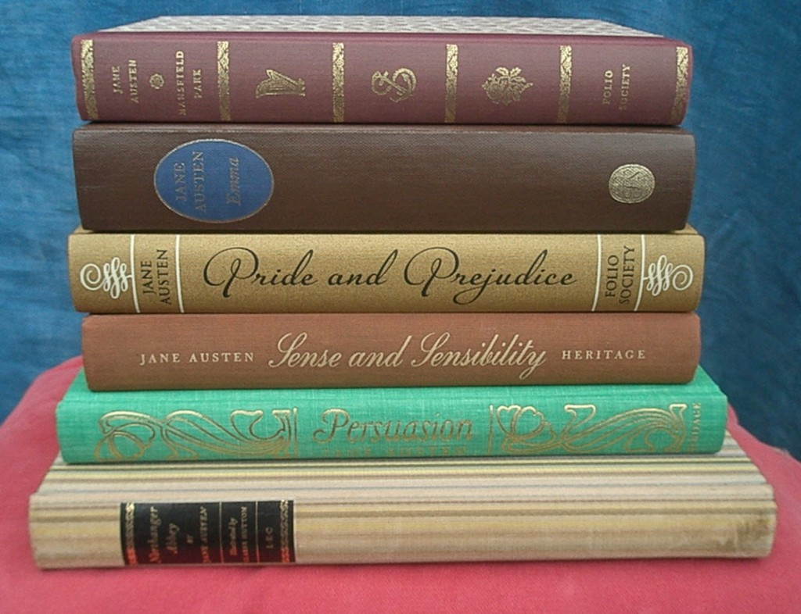

***
# Introduction.

Welcome to the the fifth edition of MaRtin's R course. Every semester I try to incorporate a different approach and new topics you can learn in R. This semester I am pleased to introduce text mining. Text mining is a relatively new area that has been experiencing an interesting development recently thanks to the new available technology to implement statistical tools to the analysis of big amount of data in text format. The main objective of text mining is to extract information from big and sometimes unstructured data to understand its contents, classify, compare and evaluate intrinsic characteristics such as sentiments, writing styles, and contents that could not be easily identified by the human eye and we make them evident with text mining tools.

In the area of business, there are many kind of applications of text mining we can exploit. For some of these applications the evidence is still growing because this is still considered as a new field, and there are also some new and unexplored applications. For example, it is common to analyze speeches of politicians to better understand his or her views about economics or about any other specific relevant topic for the voter. Central banks also publish information in form of text to support their decisions about monetary policy that can be compared to identify regime changes or to formally find out the main concerns of the policymakers. People have also been interested to analyze successful investors interviews to try to extract the hidden secrets of a good investment. The social media like Facebook, Twitter and recently WhatsApp are also sources of text data that can be accessed with R to analyze relationships between tweets and changes in financial instrument prices (to mention just an example). We also have rich information in the firm's annual reports, CEO and CFO declarations to the media, and many other sources of text data that we could incorporate in quantitative analysis to better understand economics and finance.

The objective of this introductory course is to explain the basics of text mining by using diverse examples from different fields that we can all understand. The reason we do not incorporate more finance and economics applications is twofold. First, I am interested to focus on the text mining rather than in fiance or economics models. Second, you are expected to use your young and innovative mind to propose text mining applications in the area of business. So, we start this course with an English literature example, then a Physics texts comparisons, then an analysis of news articles from a well known American news agency, and finally a tweets analysis of Mexican presidential candidates. Hopefully, you can take this examples to analyze other kind of relevant data-bases in your work and even in your PEF.

## Why R?

You may know that just a few years ago, those economic agents who had privileged access to information had a clear comparative advantage in business and overall decision taking. Today, information and data are pretty much available to everyone thanks to technology, and consequently the possibility to achieve an advantage simply due to information access has vanished or at least it is currently vanishing at a high speed. Now that data availability per se is no longer a comparative advantage in business, knowledge has become a critical aspect in business. Nowadays, it is not about having access to information; it is about knowing what to do with it to create value in business. Manipulating and transforming data into business tools and decisions has become a required skill for business professionals.

There are many ways in which you can learn basic data science, or how to transform information into valuable business intelligence, but I consider learning to code is one of them. This is because coding allows you to train your brain to think more efficiently and more productively to solve complex problems and come up with innovative solutions. In this class, you will learn how to use R, a free (yes, absolutely free) computer language which allows branching and looping as well as doing modular programming using functions. Nowadays, the Finance job market is increasingly demanding for candidates with some knowledge in the field of data science or computational finance, mainly because this boost creative problem-solving skills and data analysis abilities. The free (open source) R programming language is considered as one of the most important tools for companies such as Google, Facebook, The New York Times, Twitter, Pfizer, Merck, Bank of America, and LinkedIn among others. 

According to my view, English is the leading language for doing research and business; math and statistics are the languages used to understand nature; and R is one of the most popular languages to communicate directly to a computer. Given that computers are and will undoubtedly be part of our lives, we better learn how to communicate with them not only as a plain and boring user level but as a programmer level. As young professionals, it is important to differentiate yourselves with the rest of your colleagues and be prepared for the changing job market conditions in the area of finance. My view is that you are expected to be as proficient as possible in these three ways to interact with our environment regardless of your own professional expertise: English, math, and coding.

During your undergraduate studies, you will be expected to learn a bunch of good commercials (and unfortunately expensive) software such as Microsoft Excel, SPSS, STATA, E-Views and many others. I truly encourage you to learn them as good as you can; however, you will have to be aware that these programs are fully controlled by private firms, so there is no guarantee that their associated file formats could be readable in the future, or even exist in the future. 

Commercial software products as the ones listed above are important in the job market, but you also must realize that the main interaction with these programs is by using the mouse to click on pre-defined, limited and sometimes inflexible menus. This kind of user-interaction is most of the times ephemeral and unrecorded, so that many of the choices made during a full quantitative procedure are frequently undocumented and this turns out to be highly problematic because there is no trace about how an analysis was conducted, and also because it becomes hard to propose an extension to the analysis in phases or replication in different contexts. Learning how to code is equivalent as writing a cooking recipe and every time you click run you get the dish done. Although, chefs must pay for ovens, kitchen items and even ingredients, while in finance most of our inputs are free data and the technology is also free as R is an open source software. So, by learning how to code, you can share, expand, reproduce and innovate by your own to the point of producing original empirical results that are important inputs for research outputs as your own PEF.

Other commercial products like Microsoft Excel, SPSS, STATA, E-Views and many others, have high licensing fees and rely on mysterious black boxes. These black boxes are problematic because the data comes in and the result comes out as magic, showing no details about the procedure followed to produce the results, and the user could sadly get the wrong illusion that he or she understands statistics. This might be convenient in some specific and limited cases but in others you miss the fun that represents having access to all the details of the computation and limit the extent to which you can customise or extend to innovative and create new improved applications. The general alternative to using a point-and-click program is to familiarize with languages like R which allows writing scripts to program algorithms for financial analysis and visualisations. 

My courses here at UDEM openly incorporates data science and specifically computational finance with R to implement and learn the main subject. R is only one computer languaje, there are many and very good. We are going to use R because I consider it is still the best choice for the area of business. Also, by learning one languaje you are actually learning others without noticing. The barriers to getting started with R are currently very low because there are plenty of resources available in Internet, you only have to allocate the right amount of time and effort to it.  

## About this document: Rmarkdown.

This document has been made (or compiled) with R Markdown. This mean that the original source is a "Rmd" document produced in R Studio. 

The process of producing scientific documents has two parts: the content and the format, and we care about both of them. The content depends fully on the author or researcher; and the format depends on the software or tool we choose to write the scientific documents. Traditionally, we have two types of software, those who rely on the principle of "what you see is what you get" or WYSIWYG, and those based on LaTeX code, which when compiled will produce a document. The most well known WYSIWYG text is MS-Word processor. And probably one of the most flexible and powerful platforms to produce LaTeX documents (and more) is R markdown. An additional feature is that R Studio is a free and open-source integrated development environment (IDE) for R, whereas most of the WYSIWYG alternatives are expensive and we have to rely on one private enterprise to get updates.

## My teaching philosophy.

In 100 words:

The time and the brain are resources and constrains as both restrict the amount of time available to learn. We understand this at the university, so we use these resources efficiently. Here, we stimulate our mental capacity to create and innovate by doing research; and we teach how to think and learn in a systematic and scientific manner. Here, we promote the most fundamental human values to build a prosperous society. I love teaching almost as much as doing research because every semester represents a new opportunity to further enhance our lives by learning the most given our time constraints.

More specifically, with respect to R, my view is that you can learn as long a you practice. Courses like this are useful because you can get familiar with the computational environment, main functions, recommendations, sources and references to learn more, but the true is that you cannot learn R in one course. You have to practice. The good news is that the data you need to practice is most of the times free, the technology is your own computer, and the software is free, so you only have to spend time and effort.

# Computer programming.

Computer programming is the process of writing instructions that get executed by computers. The instructions, also known as code, are written in a programming language which the computer can understand and use to perform a task or solve a problem.

Operations as in a calculator.

```{r}
5+5
13-8
1/7
9*8
exp(5)
log(2)
1/0
5*5*5*5*5
```

Store numerical values in one variable.

```{r}
a=5+5
b=13-8
c=exp(5)
d=1/0
a
b
c
d
```

We can use previously created variables to conduct new operations.

```{r}
e=a^2+b
e
a+b
c/d
```

Variables can represent single numerical value, vector, matrix.

```{r}
(r=seq(0,1,0.1))
matrix(1,2,3)
```

Variables can represent even functions.

```{r}
VP = function(VF,r,Tiempo){
  VP = VF/(1+r)^Tiempo
  VP
}
```

```{r}
mapply(VP,20,0.1,1:50)
```


# Economic data and basic econometrics.

We can download US data directly from FRED (Federal Reserve Economic Data) and then manipulate it. In this case, we download unemployment rate and consumer confidence.

```{r}
library(alfred)
startdate="1980-01-01"
enddate="2019-10-01"
dfunrate=get_fred_series("UNRATE","unrate",
                         observation_start=startdate,
                         observation_end=enddate)
dfumcsent=get_fred_series("UMCSENT","umcsent",
                          observation_start=startdate, 
                          observation_end = enddate)
dfall=cbind(dfunrate,dfumcsent)
```

Let's view the data.

```{r}
head(dfall)
tail(dfall)
```

Let's clean the data because the date appears twice in our database.

```{r}
dfall=dfall[,c(1,2,4)]
head(dfall)
```

How many observations?

```{r}
count=nrow(dfall)  
count
```

We tell R that the date column represent a date. 

```{r}
dfall$date=as.Date(dfall$date)
tail(dfall$date)
```

```{r}
dev.new()
plot(dfall$unrate,dfall$umcsent,main = "US unemployment and consumer confidence level 1980 - 2019",xlab="Unemployment rate",
     ylab="Confidence level",col=rainbow(12),cex=1,pch=16)
```

```{r}
hist(dfall$unrate,50,col=rainbow(5),main = "US unemployment rate histogram: 1980 - 2019.",xlab="Unemployment rate",
     ylab = "Frequency")
abline(v=median(dfall$unrate),lwd=5,lty=2)
```

```{r}
hist(dfall$umcsent,20,col="red",
     main = "Consumer confidence level in the US: 1980 - 2019.",
     xlab="Consumer confidence level", ylab = "Frequency")
abline(v=median(dfall$umcsent),lwd=5,lty=2)
```

```{r}
par(mar = c(5,5,2,5))
with(dfall, plot(dfall$date,dfall$umcsent,type="l",col="red", 
             ylab="Consumer confidence",ylim=c(50,120),
             lwd=2,xlab="Date"))
par(new=T)
with(dfall, plot(dfall$date,dfall$unrate,axes=F,xlab=NA, 
                 ylab=NA,type="l",ylim=c(3,12),lwd=2))
axis(side=4)
mtext(side=4,line=3,"Unemployment rate")
legend("topleft",
       legend=c("Consumer confidence (LHS)", "Unemployment (RHS)"),
       lwd=c(2,2),col=c("red","black"),bg="white",cex=0.8)
```

Regression analysis.

```{r}
dffit=lm(log(umcsent) ~ log(unrate),data=dfall)
summary(dffit)
```

```{r}
plot(log(dfall$unrate),log(dfall$umcsent),main = "US unemployment and consumer confidence level 1980 - 2019",xlab="Log(Unemployment rate)",
     ylab="Log(Confidence level)",col=rainbow(12),cex=1,pch=16)
abline(dffit,lwd=3)
```

# Financial data and basic econometrics.

We download data from Internet.

```{r}
library(tidyquant)
library(ggplot2)
library(GGally)
S=tq_get("^GSPC", get = "stock.prices", 
         from="2010-01-03",to="2019-10-01")
y=tq_get("TYO", get = "stock.prices", 
         from="2010-01-03",to="2019-10-01")
a=tq_get("AAPL",get="stock.prices", 
         from="2010-01-03",to="2019-10-01")
h=tq_get("HSY",get="stock.prices", 
         from="2010-01-03",to="2019-10-01")

p=data.frame(S$adjusted,y$adjusted,a$adjusted,h$adjusted)
date.p=c(S$date)
tail(p)
```

Basic forecast.
```{r}
library(forecast)
plot(forecast(auto.arima(p$S.adjusted)),10)
```


```{r}
plot(forecast(auto.arima(p$a.adjusted)),10)
```


Technical analysis. The simple moving average.
```{r}
end = as_date("2019-10-01")
a %>%
  ggplot(aes(x = date, y = close)) +
  geom_line() +
  geom_ma(ma_fun = SMA, n = 20, linetype = 1, size = 1.25) +
  labs(title = "AAPL line graph", 
       subtitle = "SMA 20 days", 
       y= "Close price", x = "Date") + 
  coord_x_date(xlim = c(end - weeks(48), end), ylim = c(150, 240)) + 
  theme_tq()
```


```{r}
a %>%
  ggplot(aes(x = date, y = close, 
             open = open, high = high, 
             low = low, close = close)) +
  geom_line() +
  geom_bbands(ma_fun=SMA,sd=2, n = 20) +
  labs(title="AAPL Bollinger bands", 
       subtitle = "2 sd and SMA 20", 
       y= "Stock price", x = "Date") + 
  coord_x_date(xlim = c(end - weeks(48), end), ylim = c(140, 240)) + 
  theme_tq()
```


Prices.
```{r}
par(mar = c(5, 5, 5, 5))
plot(date.p,p$S.adjusted, type ="l", ylab = "SP500 index level",
     main = "Time series.
     Stock prices and index level", 
     xlab = "Date. 2010-01-04 to 2019-10-01")
par(new = TRUE)
plot(date.p,p$a.adjusted, type = "l", xaxt = "n", yaxt = "n",
     ylab = "", xlab = "", col = "red",ylim = c(0,220))
axis(side = 4)
par(new = TRUE)
lines(date.p,p$y.adjusted, xaxt = "n", yaxt = "n",
      ylab = "", xlab = "", col = "blue")
axis(side = 4)
par(new = TRUE)
lines(date.p,p$h.adjusted, xaxt = "n", yaxt = "n",
      ylab = "", xlab = "", col = "sienna4")
axis(side = 4)
par(new = TRUE)
axis(side = 4)
mtext("Stock price", side = 4, line = 3)
legend("topleft", c("SP500 (LHS)", "Yamaha", "Apple", "Hershey"),
       col = c("black","blue","red", "sienna4"),lwd=c(2,2,2,2),cex=0.8)
```

Returns.

```{r}
n=length(p$y.adjusted)
r.y=(p$y.adjusted[2:n]-p$y.adjusted[1:(n-1)])/p$y.adjusted[1:(n-1)]

stock_returns_monthly = c("^GSPC","TYO","AAPL","HSY") %>%
  tq_get(get  = "stock.prices",
         from = "2010-01-03",
         to   = "2019-10-01") %>%
  group_by(symbol) %>%
  tq_transmute(select     = adjusted, 
               mutate_fun = periodReturn, 
               period     = "monthly", 
               col_rename = "Ra")

date.r=data.frame(filter(stock_returns_monthly,symbol=="^GSPC"))[,2]
S=data.frame(filter(stock_returns_monthly,symbol=="^GSPC"))[,3]
y=data.frame(filter(stock_returns_monthly,symbol=="TYO"))[,3]
a=data.frame(filter(stock_returns_monthly,symbol=="AAPL"))[,3]
h=data.frame(filter(stock_returns_monthly,symbol=="HSY"))[,3]

r=data.frame(S,y,a,h)
min=min(r)
max=max(r)

head(r)

```

Time series of monthly returns.
```{r}
par(mfcol=c(4,1)) # divide the plotting space into 4 plots
par(mar=c(0.5, 0.5, 0.2, 0.2),
    oma = c(4, 6, 4, 4))
plot(date.r,r$S,type="l",xaxt="n",xlab="",lwd=2,
     ylim=c(min,max))
abline(0,0,lty=2)
plot(date.r,r$y,type="l",xaxt="n",xlab="",col="blue",lwd=2,
     ylim=c(min,max))
abline(0,0,lty=2,col="blue")
plot(date.r,r$a,type="l",xaxt ="n",xlab="",col="red",lwd=2,
     ylim=c(min,max))
abline(0,0,lty=2,col="red")
plot(date.r,r$h,type="l",xlab = "Date",col="sienna4",lwd=2,
     ylim=c(min,max))
abline(0,0,lty=2,col="sienna4")
```

Return distribution.
```{r}
boxplot(r,col=c("black","blue","red", "sienna4"),
        names = c("SP500","Yamaha","Apple","Hershey"),
        main="Boxplot. Monthly returns.
        2010-01-29 - 2019-10-01",
        ylab="Expected returns")
abline(h=0,lty=2,col="yellow",lwd=2)
```

Correlation.
```{r}
ggcorr(r,label = TRUE,label_round = 3,
       name="Correlation",geom = "tile")+
  labs(title = "Correlation matrix")
```

```{r}
plot(r$S,r$a,pch=19,col="red",
     main = "Apple and market returns",
     ylab = "Apple returns",xlab = "SP500 returns")
```

```{r}
apple=lm(a ~ S,data=r)
summary(apple)
```

```{r}
library(car)
library(lmtest)
cov = hccm(apple, type="hc1")
apple.h = coeftest(apple, vcov.=cov)
apple.h
```

```{r}
plot(r$S,r$a,pch=19,col="red",
     main = "Similar to the CAPM",
     ylab = "Apple return",xlab = "SP500 return")
lines(r$S,fitted(apple),lwd=4)
abline(v=0,lty=2)
abline(h=0,lty=2)
```

# Susan B. Anthony.

This early section show the main point of text mining techniques. In particular, how to go from a given text to the main subject of study which is called token. And then, how to deal with tokens.

Susan B. Anthony was an American social reformer and women's rights activist who played a pivotal role in the women's suffrage movement. 

```{r echo=FALSE, out.width='30%'}

```

Consider the following speech extract by Susan B. Anthony - 1873. This is a typical character vector that we might want to analyze. The whole speech it is available in Internet, you can find it as "Is it a Crime for a Citizen of the United States to Vote?" It is a great speech by the way.

```{r}
rm(list=ls())
# Here, R is asked to store the text in the variable called "text".
text <- c("Friends and fellow citizens: I stand",
          "before you tonight under indictment for", 
          "the alleged crime of having voted at the", 
          "last presidential election, without having", 
          "a lawful right to vote. It shall be my work", 
          "this evening to prove to you that in thus",
          "voting, I not only committed no crime,", 
          "but, instead, simply exercised my", 
          "citizen's rights, guaranteed to me and all", 
          "United States citizens by the National Constitution,",
          "beyond the power of any state to deny.")
# By typing the name of the variable, we reproduce its contents.
text 
```

We have 11 lines of text in the variable "text". Although this is the regular format in common printed documents, it is not the best way to analyze it in R. In order to turn it into a tidy text data-set. A tidy text format has the following principles: each variable is a column, each observation is a row, and each type of observational unit is a table. We thus define the tidy text format as being a table with one-token-per-row. In order to do this, we first need to take the original text and put it into a data frame. 

```{r}
library(dplyr) # This package provides a set of tools for efficiently manipulating datasets.
# We transform the varaible "text" into a data frame and store it in text_df.
    text_df <- data_frame(line = 1:11, text = text) 
text_df # We reproduce the result.
```

This is still not ready to be analyzed by R. Let's transform this data frame in one token per row using unnest_tokens() method.

```{r}
library(tidytext) # One of the most useful tools to do text mining with R.
  text_df %>%
    unnest_tokens(word, text)
# You can always learn about R functions by (1) typing ?unnest_tokens in the R console, 
  #(2) Look in the Help menu, (3) Google it.
```

Now we have a tidy text and every row is one word. However, this is still not ready to be analyzed since we have extremely frequent words and this does not add any valuable meaning to the text analysis. For example:

```{r}
  tokens=text_df %>%
    unnest_tokens(word, text)
  tokens %>% count(word, sort = TRUE)
```

The word "to" repeats 5 times and "the" repeats 4 times. Normally, we are not interested in these kind of words as this adds no value to understand Susan B. Anthony speech. This is how we can get rid of those words:

```{r}
 library(stringr)
data(stop_words)
    tokens2 <- tokens %>% 
      mutate(word = str_extract(word, "[a-z']+")) %>%
      anti_join(stop_words)
    tokens2
```

Now we have 29 instead of 63 words. The new frequency list of words is:

```{r}
tokens2 %>% count(word, sort = TRUE)
```

Now we can understand better the text. Normally, we analyze a significantly bigger amount of text data. 

# Jane Austen.

Let's use the text of Jane Austen's six completed, published novels from the janeaustenr R package (Silge 2016), and transform them into a tidy format. These novels explore the dependence of women on marriage in the pursuit of favourable social standing and economic security, and are fully available in R for free.

We use mutate() to annotate a line number quantity to keep track of lines in the original format, and a chapter (using a regex) to find where all the chapters are.

```{r}
library(janeaustenr)

original_books <- austen_books() %>%
  group_by(book) %>%
  mutate(linenumber = row_number(),
         chapter = cumsum(str_detect(text, regex("^chapter [\\divxlc]", 
                   ignore_case = TRUE)))) %>%
  ungroup()
original_books
```

You can browse the book contents directly in R Studio. According to the previous results we have a total of $73,422$ lines, not words, but lines.

To have a visual idea of the amount of text that we analyze, here are the six novels by Jane Austen:

```{r echo=FALSE, out.width='40%'}

```

And here is how we extract the names of these books in R.

```{r}
original_books %>% count(book)
```

The variable $n$ in the table above represent the number of text lines in each book. In total, we have  $12,624+13,030+15,349+16,235+7,856+8,328=73,422$ lines of text in the six books. If we would like to read the first 15 lines of the first book we can do:

```{r}
original_books$text[1:15]
```

And the last 10 lines of Sense & Sensibility:
```{r}
original_books$text[12614:12624]
```

## Most and least common words.

As in regular statistic procedures, we are interested to know which are the most common words used in a given material. The least common words are also informative because these might represent the distintive approach of the material or the differentiated charactersitic with respect to other materials. In order to extract the most and least common words, we need to restructure the data in the one-token-per-row format. This basically mean that instead of lines per row as in the example above, we now need one word per row.

```{r}
library(tidytext)
    tidy_books <- original_books %>%
      unnest_tokens(word, text)
    tidy_books
```

We have $725,055$ rows or words in the six books including stop words. This makes sense because remember we have $73,422$ lines, so we have an average of $725,055/73,422=9.9$ words per-line. Now it is time to remove stop words. We can remove stop words (kept in the tidytext data-set stop_words) with an anti_join(). We also avoid UTF-8 encoded text with underscores recording the underscores as words with mutate(word = str_extract(word, "[a-z']+")). In practical terms, we can do so with the following chunk of code:

```{r}
data(stop_words)
    tidy_books <- tidy_books %>% 
      mutate(word = str_extract(word, "[a-z']+")) %>%
      anti_join(stop_words)
    tidy_books
```

We end up with $216,385$ rows or words used in the six books once we get rid of stop words. If you do the math, we started with $725,055$, so the amount of stop words that we eliminate is $725,055-216,385=508,670$, that is around 70% of the original amount of words. 

These $216,385$ words are not unique, some of them are repeated in the six novels. Let's use count() to group the $216,385$ and find the new set of most common words.

```{r}
tidy_books %>% count(word, sort = TRUE)
```

So we have $216,385$ words and $13,464$ of them are unique. Let's visualize the most common words in all the six books.

```{r}
library(ggplot2)
tidy_books %>%
count(word, sort = TRUE) %>% filter(n >600) %>%
mutate(word = reorder(word, 100*n/216385)) %>% 
  ggplot(aes(word, 100*n/216385)) +
geom_col() +
xlab(NULL) +
coord_flip()
```

Note that the most common word (miss, $1,860$) represent 0.85% of the total ($216,385$).

The words that are used once in the whole collection can be extracted as:

```{r}
tidy_books %>% count(word, sort = TRUE) %>% filter(n ==1)
```

All the words used once sum $4,470$, or about 2% of the total ($216,385$).

Text mining is also about classify. The previous analysis take the six books as a total. Now, we are interested to analyze the number of words per book. This requires a slightly different arrangement.

```{r}
book_words <- austen_books() %>% unnest_tokens(word, text) %>% 
  count(book, word, sort = TRUE) %>% ungroup()
    total_words <- book_words %>%
      group_by(book) %>%
      summarize(total = sum(n))
    book_words <- left_join(book_words, total_words)
book_words
```

Now we remove the stop words.

```{r}
data(stop_words)
    book_words <- book_words %>% 
      mutate(word = str_extract(word, "[a-z']+")) %>%
      anti_join(stop_words)
    book_words
```

The word "fanny" is the most common word as Fanny Price is the heroine in Jane Austen's 1814 novel, Mansfield Park. In fact, most of these frequent words corresponds to the names of the main characters in each novel. Note that we can learn more about the contents by doing a simple classification of the six novels.

Given the analysis in the previous section (without classification per novel), we know that the word "miss" very frequently in the six books. And here is how we can know how this word is distributed among the six books:

```{r}
book_words %>% filter(word=="miss")
```

It is inevitable to get some fun here:
```{r}
book_words %>% filter(word=="martin")
```

Robert Martin is a character in Jane Austen's Emma. He is a farmer, not a gentleman, Mr. Martin is not considered handsome, Harriet Smith at first thought him quite plain. Later, she changed her mind as she was charmed by his personality and genuine friendliness. (Good for you Martin).

Enough fun. Let’s look at the distribution of term frequency (i.e. n/total) for each novel.

```{r}
library(ggplot2)
ggplot(book_words, aes(n/total, fill = book)) + 
  geom_histogram(show.legend = FALSE) + xlim(NA, 0.0002) +
  facet_wrap(~book, ncol = 2, scales = "free_y")
```

## Zipf’s Law.

Zipf's law is an empirical law, formulated using mathematical statistics, named after the linguist George Kingsley Zipf, who first proposed it.

Zipf's law states that given a large sample of words used, the frequency of any word is inversely proportional to its rank in the frequency table. So word number $n$ has a frequency proportional to $1/n$.

Thus the most frequent word will occur about twice as often as the second most frequent word, three times as often as the third most frequent word, etc. For example, in one sample of words in the English language, the most frequently occurring word, "the", accounts for nearly 7% of all the words (69,971 out of slightly over 1 million). True to Zipf's Law, the second-place word "of" accounts for slightly over 3.5% of words (36,411 occurrences), followed by "and" (28,852). Only about 135 words are needed to account for half the sample of words in a large sample.

Let's examine Zipf’s law for Jane Austen’s novels. This value is in the last column "term frequency" which measures how frequently a term occurs in a document. Later we name it simply as "tf".

```{r}
freq_by_rank <- book_words %>%
      group_by(book) %>%
      mutate(rank = row_number(),
             `term frequency` = n/total)
    freq_by_rank
```

```{r}
freq_by_rank %>% filter(word=="the")
```
Here, the word "the" accounts for 3.63% of all the words in the six novels.

Zipf ’s law is often visualized by plotting rank on the x-axis and term frequency on the y-axis, on logarithmic scales. 

```{r}
freq_by_rank %>%
ggplot(aes(rank, `term frequency`, color = book)) + 
  geom_line(size = 1.1, alpha = 0.8, show.legend = FALSE) + 
  scale_x_log10() + scale_y_log10()
```

We could view this as a broken power law with three sections. Let’s see what the exponent of the power law is for the middle section of the rank range.

```{r}
rank_subset <- freq_by_rank %>%
      filter(rank < 500,
             rank > 10)
    lm(log10(`term frequency`) ~ log10(rank), data = rank_subset)

freq_by_rank %>%
ggplot(aes(rank, `term frequency`, color = book)) +
geom_abline(intercept = -0.62, slope = -1.1, color = "gray50", linetype = 2) + geom_line(size = 1.1, alpha = 0.8, show.legend = FALSE) +
scale_x_log10() +
scale_y_log10()
```

Let's calculate the tf-idf of terms in Jane Austen’s works.

Consider a document containing 100 words wherein the word cat appears 3 times. The term frequency (i.e., tf) for cat is then $3/100=0.03$. 

Now, assume we have 10 million documents and the word cat appears in one thousand of these. Then, the inverse document frequency (i.e., idf) is calculated as $ln(10,000,000/1,000)=4$. The inverse document frequency is important because it measures how important a term is. While computing tf (term frequency), all terms are considered equally important. However, it is known that certain terms, such as "is", "of", and "that", may appear a lot of times but have little importance. Thus we need to weigh down the frequent terms while scale up the rare ones.

Finally, the Tf-idf weight is the product of these quantities: $(0.03)(4) = 0.12$.

```{r}
book_words <- book_words %>%
  bind_tf_idf(word, book, n)
book_words
```


```{r}
book_words %>% filter(word=="elinor" | word=="miss")
```

Let’s look at terms with high tf-idf in Jane Austen’s works. Some of the values for idf are the same for different terms because there are six documents in this corpus and we are seeing the numerical value for $ln(6/1)$, $ln(6/2)$, etc.

```{r}
book_words %>%
      select(-total) %>%
      arrange(desc(tf_idf))
```


Let's visualize this!
```{r}
book_words %>% arrange(desc(tf_idf)) %>% 
  mutate(word = factor(word, levels = rev(unique(word)))) %>% 
  group_by(book) %>% top_n(15) %>% ungroup %>%
  ggplot(aes(word, tf_idf, fill = book)) + 
  geom_col(show.legend = FALSE) +
   theme(axis.text.y=element_text(size=rel(0.5)))+
  labs(x = NULL, y = "tf-idf") +
  facet_wrap(~book, ncol = 2, scales = "free") + coord_flip()
```


A closer look, only the top 5 tf_idf per novel.

```{r}
book_words %>% arrange(desc(tf_idf)) %>%
  mutate(word = factor(word, levels = rev(unique(word)))) %>% 
  group_by(book) %>% top_n(5) %>% ungroup %>%
  ggplot(aes(word, tf_idf, fill = book)) + 
  geom_col(show.legend = FALSE) +
  labs(x = NULL, y = "tf-idf") +
  facet_wrap(~book, ncol = 2, scales = "free") + coord_flip()
```

## Sentiment analysis.

When human readers approach a text, we use our understanding of the emotional intent of words to infer whether a section of text is positive or negative, or perhaps characterized by some other more nuanced emotion like surprise or disgust.

There are a variety of methods and dictionaries that exist for evaluating the opinion or emotion in text. 

```{r}
get_sentiments("afinn")
get_sentiments("bing")
get_sentiments("loughran")
```

All three of these lexicons are based on unigrams, i.e., single words. These lexicons contain many English words and the words are assigned scores for positive/negative sentiment, and also possibly emotions like joy, anger, sadness, and so forth.

Let's set up the data-base again:
```{r}
tidy_books <- austen_books() %>%
  group_by(book) %>%
  mutate(linenumber = row_number(),
         chapter = cumsum(str_detect(text, regex("^chapter [\\divxlc]", 
         ignore_case = TRUE)))) %>%
  ungroup() %>%
  unnest_tokens(word, text)
```

Now, we apply the lexicon bing for each novel. We do it in blocks of $80$ lines.

```{r}
  library(tidyr)
  jane_austen_sentiment <- tidy_books %>%
  inner_join(get_sentiments("bing")) %>%
  count(book, index = linenumber %/% 80, sentiment) %>%
  spread(sentiment, n, fill = 0) %>%
  mutate(sentiment = positive - negative)
  jane_austen_sentiment
```

The index for Sense & Sensibility goes from $1$ to $157$. Each index stands for $80$ lines, thus $(157)(80)=12,560$ which coincide with the total number of lines in Sense & Sensibility, which is $12,624$. Then, we have a score of each index ($80$ lines) based on the lexicon bing for negative and positive. The last column sentiment is simpy positive-negative score.

We can show the results in a plot.

```{r}
  ggplot(jane_austen_sentiment, aes(index, sentiment, fill = book)) +
  geom_col(show.legend = FALSE) +
  facet_wrap(~book, ncol = 2, scales = "free_x")
```

The most frequent words with a high sentiment value are:

```{r}
bing_word_counts <- tidy_books %>%
  inner_join(get_sentiments("bing")) %>%
  count(word, sentiment, sort = TRUE) %>%
  ungroup()

bing_word_counts
```

We can visualize the top 10 positive and negative words.

```{r}
bing_word_counts %>%
  group_by(sentiment) %>%
  top_n(10) %>%
  ungroup() %>%
  mutate(word = reorder(word, n)) %>%
  ggplot(aes(word, n, fill = sentiment)) +
  geom_col(show.legend = FALSE) +
  facet_wrap(~sentiment, scales = "free_y") +
  labs(y = "Contribution to sentiment",
       x = NULL) +
  coord_flip()
```

We spot an anomaly in the sentiment analysis. The word “miss” is coded as negative but it is used as a title for young, unmarried women in Jane Austen’s works. If it were appropriate for our purposes, we could easily add “miss” to a custom stop-words list using bind_rows(). We could implement that with a strategy such as this.

```{r}
custom_stop_words <- bind_rows(tibble(word = c("miss"), 
                     lexicon = c("custom")), 
                     stop_words)

custom_stop_words
```

Now, we can remove the word "miss".

```{r}
data(stop_words)
    bing_word_counts <- bing_word_counts %>% 
      mutate(word = str_extract(word, "[a-z']+")) %>%
      anti_join(custom_stop_words)
    bing_word_counts
```

And we can repeat the same figure without the word "miss".

```{r}
bing_word_counts %>%
  group_by(sentiment) %>%
  top_n(10) %>%
  ungroup() %>%
  mutate(word = reorder(word, n)) %>%
  ggplot(aes(word, n, fill = sentiment)) +
  geom_col(show.legend = FALSE) +
  facet_wrap(~sentiment, scales = "free_y") +
  labs(y = "Contribution to sentiment",
       x = NULL) +
  coord_flip()
```

## Wordclouds.

Let’s look at the most common words in Jane Austen’s works as a whole again, but this time as a wordcloud.

```{r}
library(wordcloud)

tidy_books %>%
    anti_join(stop_words) %>%
  count(word) %>%
  with(wordcloud(word, n, max.words = 100,scale=c(4,.2)))
```

```{r}
library(wordcloud)

tidy_books %>%
    anti_join(custom_stop_words) %>%
  count(word) %>%
  with(wordcloud(word, n, max.words = 100,scale=c(3,.2)))
```


```{r}
library(reshape2)

tidy_books %>%
  inner_join(get_sentiments("bing")) %>%
  count(word, sentiment, sort = TRUE) %>%
  acast(word ~ sentiment, value.var = "n", fill = 0) %>%
  comparison.cloud(colors = c("gray20", "gray80"),
                   max.words = 100)
```


## Bigrams and trigrams.

We have been using the unnest_tokens function to tokenize by word, or sometimes by sentence, which is useful for the kinds of sentiment and frequency analyses. But we can also use the function to tokenize into consecutive sequences of words, called n-grams. By seeing how often word X is followed by word Y, we can then build a model of the relationships between them.

```{r}
austen_bigrams <- austen_books() %>%
  unnest_tokens(bigram, text, token = "ngrams", n = 2)
austen_bigrams
```


Let's examine the most common bigrams using dplyr’s count(). 

```{r}
austen_bigrams %>% 
  count(bigram, sort = TRUE)
```


let's separate bigram into two columns, “word1” and “word2,” at which point we can remove cases where either is a stop word. To do so, we use tidyr’s separate(), which splits a column into multiple columns based on a delimiter. 
```{r}
    bigrams_separated <- austen_bigrams %>%
      separate(bigram, c("word1", "word2"), sep = " ")
    bigrams_filtered <- bigrams_separated %>%
      filter(!word1 %in% stop_words$word) %>%
      filter(!word2 %in% stop_words$word)
    # new bigram counts:
bigram_counts <- bigrams_filtered %>% count(word1, word2, sort = TRUE)
    bigram_counts

```

Let's recombine the columns into one. To do so, we use tidyr’s unite() function. 

```{r}
bigrams_united <- bigrams_filtered %>%
      unite(bigram, word1, word2, sep = " ")
bigrams_united
```

Same process for the most common trigrams.

```{r}
austen_books() %>%
      unnest_tokens(trigram, text, token = "ngrams", n = 3) %>%
      separate(trigram, c("word1", "word2", "word3"), sep = " ") %>%
      filter(!word1 %in% stop_words$word,
             !word2 %in% stop_words$word,
!word3 %in% stop_words$word) %>% count(word1, word2, word3, sort = TRUE)
```


What are the most common “streets” mentioned in each book? 

```{r}
bigrams_filtered %>% filter(word2 == "street") %>% 
  count(book, word1, sort = TRUE)
```

Let's look at the tf-idf of bigrams across Austen novels.

```{r}
bigram_tf_idf <- bigrams_united %>%
      count(book, bigram) %>%
      bind_tf_idf(bigram, book, n) %>%
      arrange(desc(tf_idf))
    bigram_tf_idf
```

Let's visualize the bigrams with the highest tf-idf across Austen novels.

```{r}
library(ggplot2)
bigram_tf_idf %>%
arrange(desc(tf_idf)) %>%
mutate(bigram = factor(bigram, levels = rev(unique(bigram)))) %>% group_by(book) %>%
top_n(15) %>%
ungroup %>%
ggplot(aes(bigram, tf_idf, fill = book)) + geom_col(show.legend = FALSE) +
labs(x = NULL, y = "tf-idf") +
  theme(axis.text.y=element_text(size=rel(0.5)))+
facet_wrap(~book, ncol = 2, scales = "free") + coord_flip()
```

## Correlation analysis.

Counting and Correlating pairs of Words with the widyr package. Consider the book “Pride and Prejudice” divided into 10-line sections, as we did (with larger sections) for sentiment analysis. We may be interested in what words tend to appear within the same section.

Let's see what words tend to appear within the same section.
```{r}
 austen_section_words <- austen_books() %>%
      filter(book == "Pride & Prejudice") %>%
      mutate(section = row_number() %/% 10) %>%
      filter(section > 0) %>%
      unnest_tokens(word, text) %>%
      filter(!word %in% stop_words$word)
austen_section_words
```

let's count common pairs of words co-appearing within the same section.

```{r}
library(widyr)
    # count words co-occuring within sections
word_pairs <- austen_section_words %>% pairwise_count(word, section, sort = TRUE)
word_pairs
```

Let's find the words that most often occur with Darcy.

```{r}
word_pairs %>%
      filter(item1 == "darcy")
```

## Examining pairwise correlation.

Let's find the phi coefficient between words based on how often they appear in the same section.The focus of the phi coefficient is how much more likely it is that either both word X and Y appear, or neither do, than that one appears without the other.

```{r}
word_cors <- austen_section_words %>% group_by(word) %>%
filter(n() >= 20) %>% pairwise_cor(word, section, sort = TRUE)
word_cors
```

We can find the words most correlated with a word like “pounds” using a filter operation.

```{r}
word_cors %>%
      filter(item1 == "pounds")
```

Let's pick particular interesting words and find the other words most associated with them. 

```{r}
word_cors %>%
      filter(item1 %in% c("elizabeth", "pounds", "married", "pride")) %>%
      group_by(item1) %>%
      top_n(6) %>%
      ungroup() %>%
      mutate(item2 = reorder(item2, correlation)) %>%
      ggplot(aes(item2, correlation)) +
      geom_bar(stat = "identity") +
      facet_wrap(~ item1, scales = "free") +
      coord_flip()
```

# Jane Austen, H.G. Wells, Brontë sisters.

The gutenbergr package provides access to the public domain works from the Project Gutenberg collection. We can access these works using gutenberg_down load() and the Project Gutenberg ID numbers for each novel. Here we extract works by H.G. Wells.

```{r echo=FALSE, out.width='30%'}

```

We need some preliminary code.
```{r}
original_books <- austen_books() %>%
  group_by(book) %>%
  mutate(linenumber = row_number(),
         chapter = cumsum(str_detect(text, regex("^chapter [\\divxlc]",
         ignore_case = TRUE)))) %>%
  ungroup()
tidy_books <- original_books %>%
  unnest_tokens(word, text)
data(stop_words)
tidy_books <- tidy_books %>%
  anti_join(stop_words)
```


```{r}
library(gutenbergr)

hgwells <- gutenberg_download(c(35, 36, 5230, 159))
tidy_hgwells <- hgwells %>%
  unnest_tokens(word, text) %>%
  anti_join(stop_words)
```

## Common words of different authors.

What are the most common words in these novels of H.G. Wells?

```{r}
  tidy_hgwells %>%
  count(word, sort = TRUE)
```

What are the most common words in these novels of the Brontë sisters?

```{r echo=FALSE, out.width='40%'}

```

```{r}
  bronte <- gutenberg_download(c(1260, 768, 969, 9182, 767))
tidy_bronte <- bronte %>%
  unnest_tokens(word, text) %>%
  anti_join(stop_words)

tidy_bronte %>%
  count(word, sort = TRUE)
```

Let's calculate the frequency for each word in the works of Jane Austen, the Brontë's sisters, and H.G. Wells by binding the data frames together.

We use str_extract() here because the UTF-8 encoded texts from Project Gutenberg have some examples of words with underscores around them to indicate emphasis (like italics).

```{r}
frequency <- bind_rows(mutate(tidy_bronte, author = "Brontë Sisters"),
                       mutate(tidy_hgwells, author = "H.G. Wells"), 
                       mutate(tidy_books, author = "Jane Austen")) %>% 
  mutate(word = str_extract(word, "[a-z']+")) %>%
  count(author, word) %>%
  group_by(author) %>%
  mutate(proportion = n / sum(n)) %>% 
  select(-n) %>% 
  spread(author, proportion) %>% 
  gather(author, proportion, `Brontë Sisters`:`H.G. Wells`)

```
## Visualize patterns.

Words that are close to the line in these plots have similar frequencies in both sets of texts. Words that are far from the line are words that are found more in one set of texts than another. These characteristics indicate that Austen and the Brontë sisters use more similar words than Austen and H.G. Wells. Also, we see that not all the words are found in all three sets of texts and there are fewer data points in the panel for Austen and H.G. Wells.

```{r}
library(scales)
# expect a warning about rows with missing values being removed
ggplot(frequency, aes(x = proportion, y = `Jane Austen`, color = abs(`Jane Austen` - proportion))) +
  geom_abline(color = "gray40", lty = 2) +
  geom_jitter(alpha = 0.1, size = 2.5, width = 0.3, height = 0.3) +
  geom_text(aes(label = word), check_overlap = TRUE, vjust = 1.5) +
  scale_x_log10(labels = percent_format()) +
  scale_y_log10(labels = percent_format()) +
  scale_color_gradient(limits = c(0, 0.001), low = "darkslategray4", high = "gray75") +
  facet_wrap(~author, ncol = 2) +
  theme(legend.position="none") +
  labs(y = "Jane Austen", x = NULL)

```

A closer look.

```{r}
    ggplot(frequency, aes(x = proportion, y = `Jane Austen`,
                          color = abs(`Jane Austen` - proportion))) +
geom_abline(color = "gray40", lty = 2) +
geom_jitter(alpha = 0.1, size = 2.5, width = 0.3, height = 0.3) + geom_text(aes(label = word), check_overlap = TRUE, vjust = 1.5) + scale_x_log10(labels = percent_format(), limits=c(0.0001,.01)) +
scale_y_log10(labels = percent_format(), limits=c(0.0001,.01)) + scale_color_gradient(limits = c(0, 0.001),
                           low = "darkslategray4", high = "gray75") +
      facet_wrap(~author, ncol = 2) +
theme(legend.position="none") + labs(y = "Jane Austen", x = NULL)
```

## Quantify patterns.

Let's quantify how similar and different these sets of word frequencies are using a correlation test. 

```{r}
cor.test(data = frequency[frequency$author == "Brontë Sisters",],
         ~ proportion + `Jane Austen`)
cor.test(data = frequency[frequency$author == "H.G. Wells",], 
         ~ proportion + `Jane Austen`)

```


# Galileo Galilei, Christiaan Huygens, Nikola Tesla.

Let's start by downloading three books, by Galileo Galilei:

```{r echo=FALSE, out.width='60%'}

```

Christiaan Huygens:

```{r echo=FALSE, out.width='50%'}

```

Nikola Tesla: 

```{r echo=FALSE, out.width='50%'}

```

```{r}
library(gutenbergr)
    physics <- gutenberg_download(c(37729, 14725, 13476),
meta_fields = "author")
```

The names of the books are: Discourse on Floating Bodies (Galileo Galilei 1612), Treatise on Light (Christiaan Huygens 1690), Experiments with Alternate Currents of High Potential and High Frequency (Nikola Tesla 1892).

let’s use unnest_tokens() and count() to find out how many times each word is used in each text.

```{r}
physics_words <- physics %>% 
  unnest_tokens(word, text) %>%
  count(author, word, sort = TRUE) %>% ungroup()
    physics_words
```

```{r}
data(stop_words)
    physics_words <- physics_words %>% mutate(word = str_extract(word, "[a-z']+")) %>%
      anti_join(stop_words)
    physics_words
```

Let’s go ahead and calculate tf-idf, then visualize the high tf-idf words.
```{r}
plot_physics <- physics_words %>%
      bind_tf_idf(word, author, n) %>%
      arrange(desc(tf_idf)) %>%
mutate(word = factor(word, levels = rev(unique(word)))) %>%
  mutate(author = factor(author, levels = c("Galilei, Galileo",
                                            "Huygens, Christiaan",
                                            "Tesla, Nikola")))
plot_physics %>%
group_by(author) %>%
top_n(15, tf_idf) %>%
ungroup() %>%
mutate(word = reorder(word, tf_idf)) %>% ggplot(aes(word, tf_idf, fill = author)) + geom_col(show.legend = FALSE) +
labs(x = NULL, y = "tf-idf") + facet_wrap(~author, ncol = 2, scales = "free") + coord_flip()
```

Closer look. Top 10.
```{r}
plot_physics <- physics_words %>%
      bind_tf_idf(word, author, n) %>%
      arrange(desc(tf_idf)) %>%
mutate(word = factor(word, levels = rev(unique(word)))) %>%
  mutate(author = factor(author, levels = c("Galilei, Galileo",
                                            "Huygens, Christiaan",
                                            "Tesla, Nikola")))
plot_physics %>%
group_by(author) %>%
top_n(10, tf_idf) %>%
ungroup() %>%
mutate(word = reorder(word, tf_idf)) %>% ggplot(aes(word, tf_idf, fill = author)) + geom_col(show.legend = FALSE) +
labs(x = NULL, y = "tf-idf") + facet_wrap(~author, ncol = 2, scales = "free") + coord_flip()
```


"AK", “AB” “RC” and so forth are names of rays, circles, angles, and so on for Huygens. 
```{r}
library(stringr)
physics %>%
      filter(str_detect(text, "AK")) %>%
      select(text)
```


Let’s remove some of these less meaningful words to make a better, more meaningful plot.

```{r}
mystopwords <- data_frame(word = c("co", "rc", "ac", "ak", "bn",
                                       "fig", "file", "cg", "cb", "cm"))
    physics_words <- anti_join(physics_words, mystopwords, by = "word")
    plot_physics <- physics_words %>%
      bind_tf_idf(word, author, n) %>%
      arrange(desc(tf_idf)) %>%
      mutate(word = factor(word, levels = rev(unique(word)))) %>%
      group_by(author) %>%
      top_n(15, tf_idf) %>%
      ungroup %>%
      mutate(author = factor(author, levels = c("Galilei, Galileo",
                                                "Huygens, Christiaan",
                                                "Tesla, Nikola")))
ggplot(plot_physics, aes(word, tf_idf, fill = author)) + geom_col(show.legend = FALSE) +
labs(x = NULL, y = "tf-idf") +
facet_wrap(~author, ncol = 2, scales = "free") + coord_flip()
```

# The AssociatedPress dataset.

Let's load the AssociatedPress data-set, provided by the topicmodels package, as an example of a DocumentTermMatrix. This is a collection of 2,246 news articles from an American news agency, mostly published around 1988.

```{r}
library(topicmodels)
    data("AssociatedPress")
    AssociatedPress
```


Le's use the LDA() function from the topicmodels package, setting k = 2, to create a two-topic LDA model. This function returns an object containing the full details of the model fit, such as how words are associated with topics and how topics are associated with documents.

```{r}
ap_lda <- LDA(AssociatedPress, k = 2, control = list(seed = 1234))
    ap_lda
```

## Word-topic probabilities.

Let's use tidy() method for extracting the per-topic-per-word probabilities, called $\beta$, from the model.
```{r}
library(tidytext)
ap_topics <- tidy(ap_lda, matrix = "beta")
ap_topics
```

Let's use dplyr’s top_n() to find the 10 terms that are most common within each topic.

```{r}
library(ggplot2)
    library(dplyr)
    ap_top_terms <- ap_topics %>%
      group_by(topic) %>%
      top_n(10, beta) %>%
      ungroup() %>%
      arrange(topic, -beta)
ap_top_terms %>%
mutate(term = reorder(term, beta)) %>% ggplot(aes(term, beta, fill = factor(topic))) + geom_col(show.legend = FALSE) +
facet_wrap(~ topic, scales = "free") + coord_flip()
```

To constrain it to a set of especially relevant words, let's filter for relatively common words, such as those that have a $\beta$ greater than 1/1000 in at least one topic.

```{r}
beta_spread <- ap_topics %>%
  mutate(topic = paste0("topic", topic)) %>%
  spread(topic, beta) %>%
  filter(topic1 > .001 | topic2 > .001) %>%
  mutate(log_ratio = log2(topic2 / topic1))
beta_spread
```

Let's visualize the words with the greatest differences between the two topics. 

```{r}
beta_spread %>%
mutate(contribution = log_ratio) %>% arrange(desc(abs(contribution))) %>%
head(20) %>%
mutate(term = reorder(term, contribution)) %>% 
  ggplot(aes(term, log_ratio, fill = log_ratio > 0)) + geom_col(show.legend = FALSE) +
xlab("Words preceded by \"not\"") +
ylab("Sentiment score * number of occurrences") + coord_flip()
```

Let's use tidy() method for extracting the per-topic-per-word probabilities, called $\gamma$, from the model.

```{r}
ap_documents <- tidy(ap_lda, matrix = "gamma")
    ap_documents
```

We can see that document 6 is drawn almost entirely from topic 2, having a $\gamma$ from topic 1 close to zero.

To check this answer, we could tidy() the document-term matrix and check what the most common words in that document are.

```{r}
tidy(AssociatedPress) %>%
      filter(document == 6) %>%
      arrange(desc(count))
```

# Unsupervised learning example.

Example: The Great Library Heist - know the “right answer”!!

It can be useful to try it on a very simple case where you know the “right answer”. 
Let's collect a set of documents that definitely relate to four separate topics, then perform topic modeling to see whether the algorithm can correctly distinguish the four groups.
```{r}
titles <- c("Twenty Thousand Leagues under the Sea", "The War of the Worlds",
                "Pride and Prejudice", "Great Expectations")
    library(gutenbergr)
    books <- gutenberg_works(title %in% titles) %>%
      gutenberg_download(meta_fields = "title")
```

Let's divide these into chapters, use tidytext’s unnest_tokens() to separate them into words, then remove stop_words.
We’re treating every chapter as a separate “document”!!

```{r}
library(stringr)
    # divide into documents, each representing one chapter
reg <- regex("^chapter ", ignore_case = TRUE) 
by_chapter <- books %>%
      group_by(title) %>%
      mutate(chapter = cumsum(str_detect(text, reg))) %>%
      ungroup() %>%
      filter(chapter > 0) %>%
      unite(document, title, chapter)
    # split into words
    by_chapter_word <- by_chapter %>%
      unnest_tokens(word, text)
    # find document-word counts
word_counts <- by_chapter_word %>% anti_join(stop_words) %>% count(document, word, sort = TRUE) %>% ungroup()
word_counts
```

The topicmodels package requires a DocumentTermMatrix.
So, let's cast a one-token-per-row table into a DocumentTermMatrix with tidytext’s cast_dtm(). 

```{r}
chapters_dtm <- word_counts %>%
      cast_dtm(document, word, n)
    chapters_dtm
```

Let's then use the LDA() function to create a four-topic model.

```{r}
chapters_lda <- LDA(chapters_dtm, k = 4, control = list(seed = 1234))
    chapters_lda
```

Let's examine per-topic-per-word probabilities.

```{r}
chapter_topics <- tidy(chapters_lda, matrix = "beta")
    chapter_topics
```

Let's use dplyr’s top_n() to find the top five terms within each topic.

```{r}
top_terms <- chapter_topics %>%
      group_by(topic) %>%
      top_n(5, beta) %>%
      ungroup() %>%
arrange(topic, -beta)
top_terms
```

Let's visualize this using a ggplot2.

```{r}
library(ggplot2)
top_terms %>%
mutate(term = reorder(term, beta)) %>% ggplot(aes(term, beta, fill = factor(topic))) + geom_col(show.legend = FALSE) +
facet_wrap(~ topic, scales = "free") + coord_flip()
```

## Per-document classification.

We want to know which topics are associated with each document.
We can find this by examining the per-document-per-topic probabilities, $\gamma$.

```{r}
chapters_gamma <- tidy(chapters_lda, matrix = "gamma")
    chapters_gamma
```

Let's see how well our unsupervised learning did at distinguishing the four books. To do so, first we re-separate the document name into title and chapter, after which we can visualize the per-document-per-topic probability for each. 

```{r}
chapters_gamma <- chapters_gamma %>%
separate(document, c("title", "chapter"), sep = "_", convert = TRUE)
    chapters_gamma
```

Let's visualize this!

```{r}
# reorder titles in order of topic 1, topic 2, etc. before plotting
chapters_gamma %>%
  mutate(title = reorder(title, gamma * topic)) %>%
  ggplot(aes(factor(topic), gamma)) +
  geom_boxplot() +
  facet_wrap(~ title)
```

Now we want to know if there are any cases where the topic most associated with a chapter belonged to another book? 
To do so, first we find the topic that was most associated with each chapter using top_n(), which is effectively the “classification” of that chapter.

```{r}
chapter_classifications <- chapters_gamma %>%
      group_by(title, chapter) %>%
      top_n(1, gamma) %>%
ungroup()
chapter_classifications
```

We can then compare each to the “consensus” topic for each book (the most common topic among its chapters), and see which were most often misidentified.

```{r}
book_topics <- chapter_classifications %>%
      count(title, topic) %>%
      group_by(title) %>%
      top_n(1, n) %>%
      ungroup() %>%
      transmute(consensus = title, topic)
    chapter_classifications %>%
      inner_join(book_topics, by = "topic") %>%
      filter(title != consensus)
```

## By-word assignments: augment.

We want to take the original document-word pairs and find which words in each document were assigned to which topic.

```{r}
assignments <- augment(chapters_lda, data = chapters_dtm)
    assignments
```

Let's combine this assignments table with the consensus book titles to find which words were incorrectly classified.

```{r}
assignments <- assignments %>%
separate(document, c("title", "chapter"), sep = "_", convert = TRUE) %>% inner_join(book_topics, by = c(".topic" = "topic"))
assignments
```

Let's visualize a confusion matrix, showing how often words from one book were assigned to another, using dplyr’s count() and ggplot2’s geom_tile.

```{r}
assignments %>%
      count(title, consensus, wt = count) %>%
      group_by(title) %>%
      mutate(percent = n / sum(n)) %>%
      ggplot(aes(consensus, title, fill = percent)) + 
      geom_tile() +
      scale_fill_gradient2(high = "red", label = scales::percent_format()) +
      theme_minimal() +
      theme(axis.text.x = element_text(angle = 90, hjust = 1),
            panel.grid = element_blank()) +
      labs(x = "Book words were assigned to",
           y = "Book words came from",
           fill = "% of assignments")
```

What were the most commonly mistaken words?

```{r}
wrong_words <- assignments %>%
      filter(title != consensus)
wrong_words
```


```{r}
wrong_words %>%
  count(title, consensus, term, wt = count) %>%
  ungroup() %>%
  arrange(desc(n))
```

we can confirm “flopson” appears only in Great Expectations, even though it’s assigned to the Pride and Prejudice cluster. This shows that the LDA algorithm is stochastic, and it can accidentally land on a topic that spans multiple books. 

```{r}
word_counts %>%
      filter(word == "flopson")
```


# Tweets de candidatos presidenciales (en español).

Código adaptado de Análisis de sentimientos con R - Léxico Afinn, por Juan Bosco Mendoza Vega. https://rpubs.com/jboscomendoza/

```{r}
library(tidyverse)
library(tidytext)
library(tm)
library(lubridate)
library(zoo)
library(scales)
```
Definimos un tema para facilitar la visualización de nuestros resultados.

```{r}
tema_graf <-
  theme_minimal() +
  theme(text = element_text(family = "serif"),
        panel.grid.minor = element_blank(),
        strip.background = element_rect(fill = "#EBEBEB", colour = NA),
        legend.position = "none",
        legend.box.background = element_rect(fill = "#EBEBEB", colour = NA))
```


```{r}
tuits <- read.csv("tuits_candidatos.csv", 
                  stringsAsFactors = F, fileEncoding = "latin1") %>% 
  tbl_df()
```
Nuestros datos lucen así:

```{r}
tuits
```

El número de twits (2016 al 2018) por candidato se extrae de la siguiente manera:
```{r}
tuits %>% count(screen_name, sort = TRUE)
```

Para este análisis de sentimiento usaremos el léxico Afinn. Este es un conjunto de palabras, puntuadas de acuerdo a qué tan positivamente o negativamente son percibidas. Las palabras que son percibidas de manera positiva tienen puntuaciones de -4 a -1; y las positivas de 1 a 4.

La versión que usaremos es una traducción automática, de inglés a español, de la versión del léxico presente en el conjunto de datos sentiments de tidytext, con algunas correcciones manuales. Por supuesto, esto quiere decir que este léxico tendrá algunos defectos, pero será suficiente para nuestro análisis.

```{r}
afinn <- read.csv("lexico_afinn.en.es.csv", 
                  stringsAsFactors = F, fileEncoding = "latin1") %>% 
  tbl_df()
```
Este léxico luce así:
```{r}
afinn
```

Tenemos tres columnas. Una con palabras en español, su puntuación y una tercera columna con la misma palabra, en inglés.

Hora de preparar nuestros datos para análisis.

## Peparando los datos

Fechas

Lo primero que necesitamos es filtrar el objeto tuits para limitar nuestros datos sólo a los del 2018. Manipulamos la columna created_at con la función separate() de tidyr. Separamos esta columna en una fecha y hora del día, y después separaremos la fecha en día, mes y año. Usamos la función ymd() de lubridate para convertir la nueva columna Fecha a tipo de dato fecha.

Por último, usamos filter() de dplyr para seleccionar sólo los tuits hechos en el 2018.

```{r}
tuits <- 
  tuits %>%
  separate(created_at, into = c("Fecha", "Hora"), sep = " ") %>%
  separate(Fecha, into = c("Dia", "Mes", "Periodo"), sep = "/",
           remove = FALSE) %>%
  mutate(Fecha = dmy(Fecha),
         Semana = week(Fecha) %>% as.factor(),
         text = tolower(text)) %>%
  filter(Periodo == 2018)
```

Nuestros datos lucen así:

```{r}
tuits
```

El número de twits (2018) por candidato se extrae de la siguiente manera:
```{r}
tuits %>% count(screen_name, sort = TRUE)
```


## Convirtiendo tuits en palabras

Necesitamos separar cada tuit en palabras, para así asignarle a cada palabra relevante una puntuación de sentimiento usando el léxico Afinn. Usamos la función unnest_token() de tidytext, que tomara los tuits en la columna text y los separá en una nueva columna llamada Palabra Hecho esto, usamos left_join() de dplyr, para unir los objetos tuits y afinn, a partir del contenido de la columna Palabra. De este modo, obtendremos un data frame que contiene sólo los tuits con palabras presentes en el léxico Afinn.

Además, aprovechamos para crear una columna con mutate() de dplyr a las palabras como Positiva o Negativa. Llamaremos esta columna Tipo y cambiamos el nombre de la columna screen_name a Candidato.


```{r}
tuits_afinn <- 
  tuits %>%
  unnest_tokens(input = "text", output = "Palabra") %>%
  inner_join(afinn, ., by = "Palabra") %>%
  mutate(Tipo = ifelse(Puntuacion > 0, "Positiva", "Negativa")) %>% 
  rename("Candidato" = screen_name)
```
Obtenemos también una puntuación por tuit, usando group_by() y summarise() de dplyr, y la agregamos tuits para usarla después. Tambien asignamos a los tuits sin puntuación positiva o negativa un valor de 0, que indica neutralidad. Por último cambiamos el nombre de la columna screen_name a Candidato


```{r}
tuits <-
  tuits_afinn %>%
  group_by(status_id) %>%
  summarise(Puntuacion_tuit = mean(Puntuacion)) %>%
  left_join(tuits, ., by = "status_id") %>% 
  mutate(Puntuacion_tuit = ifelse(is.na(Puntuacion_tuit), 0, Puntuacion_tuit)) %>% 
  rename("Candidato" = screen_name)
```

```{r}
tuits_afinn
```

Con esto estamos listos para empezar.

## Explorando los datos, medias por día

Empecemos revisando cuántas palabras en total y cuantas palabras únicas ha usado cada candidato con count(), group_by() y  distinct() de dplyr.

```{r}
# Total
tuits_afinn %>%
  count(Candidato)
``` 

```{r}
# Únicas
tuits_afinn %>% 
  group_by(Candidato) %>% 
  distinct(Palabra) %>% 
  count()
```

Y veamos también las palabras positivas y negativas más usadas por cada uno de ellos, usando map() de purr, top_n() de  dplyr() y ggplot.


```{r}
map(c("Positiva", "Negativa"), function(sentimiento) {
  tuits_afinn %>%
    filter(Tipo ==  sentimiento) %>%
    group_by(Candidato) %>%
    count(Palabra, sort = T) %>%
    top_n(n = 10, wt = n) %>%
    ggplot() +
    aes(Palabra, n, fill = Candidato) +
    geom_col() +
    facet_wrap("Candidato", scales = "free") +
    scale_y_continuous(expand = c(0, 0)) +
    coord_flip() +
    labs(title = sentimiento) +
    tema_graf
})
```

Aunque hay similitudes en las palabras usadas, también observamos una diferencia considerable en la cantidad de palabras usadas por el candidato con menos palabras (157, 72 únicas de lopezobrador_) y la candidata con más (730, 189 únicas de Mzavalagc).

Si calculamos el sentimiento de los candidatos, haciendo una suma de puntuaciones, aquellos con más palabras podrían tener puntuaciones más altas, lo cual sesgaría nuestra interpretación de la magnitud de los resultados. En un caso como este, nos conviene pensar en una medida resumen como la media para hacer una mejor interpretación de nuestros datos.

Quitamos “no” de nuestras palabras. Es una palabra muy comun en español que no necesariamente implica un sentimiento negativo. Es la palabra negativa más frecuente entre los candidatos, por lo que podría sesgar nuestros resultados.


```{r}
tuits_afinn <-
  tuits_afinn %>%
  filter(Palabra != "no")
```

Repetimos el análisis.

```{r}
map(c("Positiva", "Negativa"), function(sentimiento) {
  tuits_afinn %>%
    filter(Tipo ==  sentimiento) %>%
    group_by(Candidato) %>%
    count(Palabra, sort = T) %>%
    top_n(n = 10, wt = n) %>%
    ggplot() +
    aes(Palabra, n, fill = Candidato) +
    geom_col() +
    facet_wrap("Candidato", scales = "free") +
    scale_y_continuous(expand = c(0, 0)) +
    coord_flip() +
    labs(title = sentimiento) +
    tema_graf
})
```

Como deseamos observar tendencias, vamos a obtener la media de sentimientos por día, usando group_by() y summarise() y asignamos los resultados a tuits_afinn_fecha

```{r}
tuits_afinn_fecha <-
  tuits_afinn %>%
  group_by(status_id) %>%
  mutate(Suma = mean(Puntuacion)) %>%
  group_by(Candidato, Fecha) %>%
  summarise(Media = mean(Puntuacion))
```

Veamos nuestros resultados con ggplot()
```{r}
tuits_afinn_fecha %>%
  ggplot() +
  aes(Fecha, Media, color = Candidato) +
  geom_line() +
  tema_graf +
  theme(legend.position = "top")
```

No nos dice mucho. Sin embargo, si separamos las líneas por candidato, usando facet_wrap(), será más fácil observar el las tendencias de los Candidatos.

```{r}
tuits_afinn_fecha %>%
  ggplot() +
  aes(Fecha, Media, color = Candidato) +
  geom_hline(yintercept = 0, alpha = .35) +
  geom_line() +
  facet_grid(Candidato~.) +
  tema_graf +
  theme(legend.position = "none")
```

## Usando LOESS (regression local)
Una manera en que podemos extraer tendencias es usar el algoritmo de regresión local LOESS. Con este algoritmo trazaremos una línea que intenta ajustarse a los datos contiguos. Como sólo tenemos una observación por día, quitaremos el sombreado que indica el error estándar.

Una explicación más completa de LOESS se encuentra aquí:

https://www.itl.nist.gov/div898/handbook/pmd/section1/pmd144.htm
Usamos la función geom_smooth() de ggplot2, con el argumento method = "loess" para calcular y graficar una regresión local a partir de las medias por día.


```{r}
tuits_afinn_fecha %>%
  ggplot() +
  aes(Fecha, Media, color = Candidato) +
  geom_smooth(method = "loess", fill = NA) +
  tema_graf
```
En realidad, podemos obtener líneas muy similares directamente de las puntuaciones.


```{r}
tuits_afinn %>%
  ggplot() +
  aes(Fecha, Puntuacion, color = Candidato) +
  geom_smooth(method = "loess", fill = NA) +
  tema_graf
```

la manera en que el algoritmo LOESS llega a sus resultados. También es manera de observar que este algoritmo no nos permite obtener una formula de regresión, de la misma manera que lo haríamos

Si separamos las lineas por candidato y mostramos los puntos a partir de los cuales se obtienen las líneas de regresión, podemos observar con más claridad la manera en que el algoritmo LOESS llega a sus resultado. Haremos esto con facet_wrap() y  geom_point.

```{r}
tuits_afinn %>%
  ggplot() +
  aes(Fecha, Puntuacion, color = Candidato) +
  geom_point(color = "#E5E5E5") + 
  geom_smooth(method = "loess", fill = NA) +
  facet_wrap(~Candidato) +
  tema_graf
```
Esto es conveniente, pues podemos identificar tendencias de datos que en apariencia no tienen ninguna. Al mismo tiempo, esto es una desventaja, pues podemos llegar a sobre ajustar la línea de regresión y, al interpretarla, llegar a conclusiones que no siempre son precisas.

Comparemos los resultados de al algoritmo LOESS con los resultados de una Regresión Lineal ordinaria, que intentará ajustar una recta.
```{r}
tuits_afinn_fecha %>%
  ggplot() +
  aes(Fecha, Media, color = Candidato) +
  geom_point(color = "#E5E5E5") + 
  geom_smooth(method = "lm", fill = NA) +
  facet_wrap(~Candidato) +
  tema_graf
```
observar una tendencia, pero en la mayoría de los casos no es tan “clara” como parecería usando LOESS. También podemos ver cómo es que pocos datos, es posible que valores extremos cambien notablemente la forma de una línea trazada con LOESS, de manera similar a cómo cambian la pendiente de una Regresión Lineal ordinaria. Esto es osbervable con los datos de lopezobrador_.

Para nuestros fines, LOESS es suficiente para darnos un panorama general en cuanto a la tendencia de sentimientos en los candidatos. No obstante, es importante ser cuidadosos con las interpretaciones que hagamos.

## Usando la media móvil
La media móvil se obtiene a partir de subconjuntos de datos que se encuentran ordenados. En nuestro ejemplo, tenemos nuestros datos ordenados por fecha, por lo que podemos crear subconjuntos de fechas consecutivas y obtener medias de ellos. En lugar de obtener una media de puntuación de todas las fechas en nuestros datos, obtenemos una media de los días 1 al 3, después de los días 2 al 4, después del 3 al 5, y así sucesivamente hasta llegar al final de nuestras fechas.

Lo que obtendríamos con esto son todos los agregados de tres días consecutivos, que en teoría debería ser menos fluctuantes que de los días individuales, es decir, más estables y probablemente más apropiados para identificar tendencias.

Crearemos medias móviles usando rollmean() de zoo. Con esta función calculamos la media de cada tres días y la graficamos con ggplot.
```{r}
tuits_afinn_fecha %>%
  group_by(Candidato) %>%
  mutate(MediaR = rollmean(Media, k = 3, align = "right", na.pad = TRUE)) %>%
  ggplot() +
  aes(Fecha, MediaR, color = Candidato) +
  geom_hline(yintercept = 0, alpha = .35) +
  geom_line() +
  facet_grid(Candidato~.) +
  tema_graf
```

Si comparamos con la gráfica que obtuvimos a partir de las medias por día, esta es menos “ruidosa” y nos permite observar más fácilmente las tendencias.

Comparando sentimientos positivos y negativos
Es posible que no nos interen las puntuaciones de sentimiento de cada día, sólo si la tendencia ha sido positiva o negativa. Como ya etiquetamos la puntuación de nuestros tuits como “Positiva” y “Negativa”, sólo tenemos que obtener proporciones y graficar.

Primero, veamos que proporción de tuits fueron positivos y negativos, para todo el 2018 y para cada Candidato. Usamos  geom_col() de ggplot2 para elegir el tipo de gráfica y la función percent_format() de scales para dar formato de porcentaje al eje y.

```{r}
tuits_afinn %>%
  count(Candidato, Tipo) %>%
  group_by(Candidato) %>%
  mutate(Proporcion = n / sum(n)) %>%
  ggplot() +
  aes(Candidato, Proporcion, fill = Tipo) +
  geom_col() +
  scale_y_continuous(labels = percent_format()) +
  tema_graf +
  theme(legend.position = "top")
```

Si obtnemos la proporción de positiva y negativa por día, podemos obsrvar cómo cambia con el paso del tiempo. Usamos el argumento width = 1 de geom_col() para quitar el espacio entre barras individuales y el argumento expand = c(0, 0) de  scale_x_date() para quitar el espacio en blanco en los extremos del eje x de nuestra gráfica (intenta crear esta gráfica sin este argumento para ver la diferencia).
```{r}
tuits_afinn %>%
  group_by(Candidato, Fecha) %>%
  count(Tipo) %>%
  mutate(Proporcion = n / sum(n)) %>%
  ggplot() +
  aes(Fecha, Proporcion, fill = Tipo) +
  geom_col(width = 1) +
  facet_grid(Candidato~.) +
  scale_y_continuous(labels = percent_format()) +
  scale_x_date(expand = c(0, 0)) +
  tema_graf +
  theme(legend.position = "top")
```

En este ejemplo, como los candidatos no tuitearon todos los días, tenemos algunos huecos en nuestra gráfica. De todos modos es posible observar la tendencia general de la mayoría de ellos.

## Bloxplots (diagrama caja y bigotes)
Una manera más en la que podemos visualizar la puntuación sentimientos es usando boxplots. En nuestro análisis quizás no es la manera ideal de presentar los resultados dado que tenemos una cantidad relativamente baja de casos por Candidato. Sin embargo, vale la pena echar un vistazo, pues es una herramienta muy útil cuando tenemos una cantidad considerable de casos por analizar.

En este tipo de gráficos, la caja representa el 50% de los datos, su base se ubica en el primer cuartil (25% de los datos debajo) y su tope en el tercer cuartil (75% de los datos debajo). La línea dentro de la caja representa la mediana o secundo cuartil (50% de los datos debajo). Los bigotes se extienden hasta abarcar un largo de 1.5 veces el alto de la caja, o hasta abarcar todos los datos, lo que ocurra primero. Los puntos son los outliers, datos extremos que salen del rango de los bigotes. Por todo lo anterior, esta visualización es preferible cuando tenemos datos con distribuciones similares a una normal.

Usamos la función geom_boxplot() de ggplot2 para elegir el tipo de gráfica. Creamos un boxplot por candidato.


```{r}
tuits %>%
  ggplot() +
  aes(Candidato, Puntuacion_tuit, fill = Candidato) +
  geom_boxplot() +
  tema_graf
```

También podemos crear boxplots para ver cambios a través del tiempo, sólo tenemos que agrupar nuestros datos. Como nuestros datos ya tienen una columna para el mes del año, usaremos esa como variable de agrupación. Nota que usamos  factor() dentro de mutate() para cambiar el tipo de dato de Mes, en R los boxplots necesitan una variable discreta en el eje x para mostrarse correctamente.
```{r}
tuits %>%
  mutate(Mes = factor(Mes)) %>% 
  ggplot() +
  aes(Mes, Puntuacion_tuit, fill = Candidato) +
  geom_boxplot(width = 1) +
  facet_wrap(~Candidato) +
  tema_graf +
  theme(legend.position = "none")
```

## Usando densidades
Por último, podemos analizar las tendencias de sentimientos usando las funciones de densidad de las puntuaciones. ggplot2 tiene la función geom_density() que hace muy fácil crear y graficar estas funciones.
```{r}
tuits %>%
  ggplot() +
  aes(Puntuacion_tuit, color = Candidato) +
  geom_density() +
  facet_wrap(~Candidato) +
  tema_graf
```
Por supuesto, también podemos observar las tendencias a través del tiempo usando facet_grid() para crear una cuadrícula de gráficas, con los candidatos en el eje x y los meses en el eje y.

```{r}
tuits %>%
  ggplot() +
  aes(Puntuacion_tuit, color = Candidato) +
  geom_density() +
  facet_grid(Candidato~Mes) +
  tema_graf
```

Para concluir
En este artículo revisamos algunas de las estrategias principales para analizar sentimientos con R, usando el léxico Afinn. Este léxico le asigna una puntuación a las palabras, de acuerdo a su contenido, que puede ser positivo o negativo.

En realidad, que la puntuación sea de tipo numérico es lo nos abre una amplia gama de posibilidades para analizar sentimientos usando el léxico Afinn. Con conjuntos de datos más grandes que el que usamos en este ejemplo, es incluso plausible pensar en análisis más complejos, por ejemplo, establer correlaciones y crear conglomerados.

Aunque no nos adentramos al análisis de los resultados que obtuvimos con nuestros datos, algunas tendencias se hicieron evidentes rápidamente. Por ejemplo, la mayoría de los candidatos ha tendido a tuitear de manera positiva. Con un poco de conocimiento del tema, sin duda podríamos encontrar información útil e interesante.


# Games.

This has to be done only once:
```{r}
#install.packages("devtools")
#devtools::install_github('RLesur/Rcade')
```
And do this to play:
```{r}
#library(Rcade)
#Rcade::games$Pacman
```

# R references.

The following are a constant growing list of unsorted online R references.

R is a free software environment for statistical computing and graphics https://www.r-project.org/

R - Install R and R Studio on Windows 10 for PC: https://youtu.be/9-RrkJQQYqY MAC: https://youtu.be/GLLZhc_5enQ

http://stat.slu.edu/~speegle/_book/index.html#installing-r

R Studio provides popular open source and enterprise-ready professional software for the R statistical computing environment https://www.rstudio.com/

R Programming for Data Science https://bookdown.org/rdpeng/rprogdatascience/

R for Data Science https://r4ds.had.co.nz/

R-ladies is a world-wide organization to promote gender diversity in the R community https://rladies.org/

Learn Data Science Online https://www.datacamp.com/

Social Science Data and Statistics Resources https://researchguides.library.tufts.edu/data/r

Daily news about using open source R for big data analysis, predictive modelling, data science, and visualization since 2008 https://blog.revolutionanalytics.com/

Stack Overflow is the largest online community for programmers to learn, share their knowledge and build their careers https://stackoverflow.com

R-Bloggers is about empowering bloggers to empower other R users https://www.r-bloggers.com

Swirl teaches you R programming and data science interactively, at your own pace, and right in the R console! https://swirlstats.com/

Foundations of Statistics with R https://mathstat.slu.edu/~speegle/_book/

Introduction to Econometrics with R https://www.econometrics-with-r.org/

The technology learning platform https://www.pluralsight.com

This website presents documents, examples, tutorials and resources on R and data mining http://www.rdatamining.com

rstats (as a hashtag in Twitter)

DataScience (as a hashtag in Twitter)

https://www.pluralsight.com/search?q=R

http://wdb.ugr.es/~bioestad/

Social Science Data and Statistics Resources http://researchguides.library.tufts.edu/data/r

Milestones in AI, Machine Learning, Data Science, and visualization with R and Python since 2008 http://blog.revolutionanalytics.com/ 

http://www.datasciencecentral.com/profiles/blogs/list-of-companies-using-r

